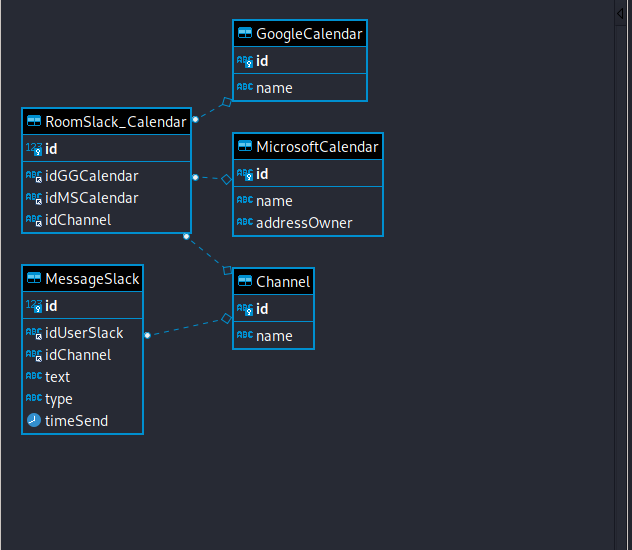

# Design Database
***

## Các thành phần đối tượng của dự án Slack - Calendar

### Channel
- Mục đích tạo đối tượng : Lưu trữ các Channel bên Slack có liên kết với Google Calendar hoặc Outlook Calendar

### Message Slack
- Mục đích tạo đối tượng : Lưu trữ các message có gửi thông tin yêu cầu Bot về Calendar.

### MicrosoftCalendar
- Mục đích tạo đối tượng : Lưu trữ thoong tin các Outlook Calendar

### GoogleCalendar
- Mục đích tạo đối tượng : Lưu trữ thông tin các Google Calendar

### RoomSlack_Calendar
- Mục đích tạo đối tượng : bảng trung gian lưu trữ thông tin về các liên kết id của Channel, GoogleCalendar, MicrosoftCalendar.

***
## Mối quan hệ giữa các thành phần của dự án Slack - Calendar

### Channel với MesageSlack,RoomUserSlack_Calendar
- Channel có quan hệ 1-n với thành phần MesageSlack
- Channel có quan hệ 1-n với thành phần RoomUserSlack_Calendar

### MessageSlack với Channel
- MessageSlack có quan hệ n-1 đối với thành phần Channel

### MicrosoftCalendar với RoomUserSlack_Calendar
- MicrosoftCalendar có quan hệ 1-n với thành phần RoomUserSlack_Calendar

### GoogleCalendar với RoomUserSlack_Calendar
- GoogleCalendar có quan hệ 1-n với thành phần RoomUserSlack_Calendar

### RoomSlack_Calendar với GoogleCalendar,MicrosoftCalendar,Channel
- GoogleCalendar có quan hệ 1-n với thành phần RoomUserSlack_Calendar
- MicrosoftCalendar có quan hệ 1-n với thành phần RoomUserSlack_Calendar
- Channel có quan hệ 1-n với thành phần RoomUserSlack_Calendar

***
## Thiết kế cơ sở dữ liệu lưu trữ dữ liệu người dùng.

1. Google Calendar
Thuộc tính : 
- `id` string primary key
- `name` string

2. Outlook Calendar
Thuộc tính : 
- `id` string primary key
- `name` string
- `addressOwner` string

3. Channel
Thuộc tính : 
- `id` string primary key
- `name` string

4. MesageSlack
Thuộc tính : 
- `id` string primary key
- `idChannel` string foreign key,
- `text` string
- `type` string
- `timeSend` datetime

5. RoomUserSlack_Calendar
Thuộc tính : 
- `id` string primary key
- `idGGCalendar` string foreign key,
- `idMSCalendar` string foreign key,
- `idChannel` string foreign key,

Hình minh họa Diagram :

Code Script mysql
[Link Script](ScriptCreateDB.sql)