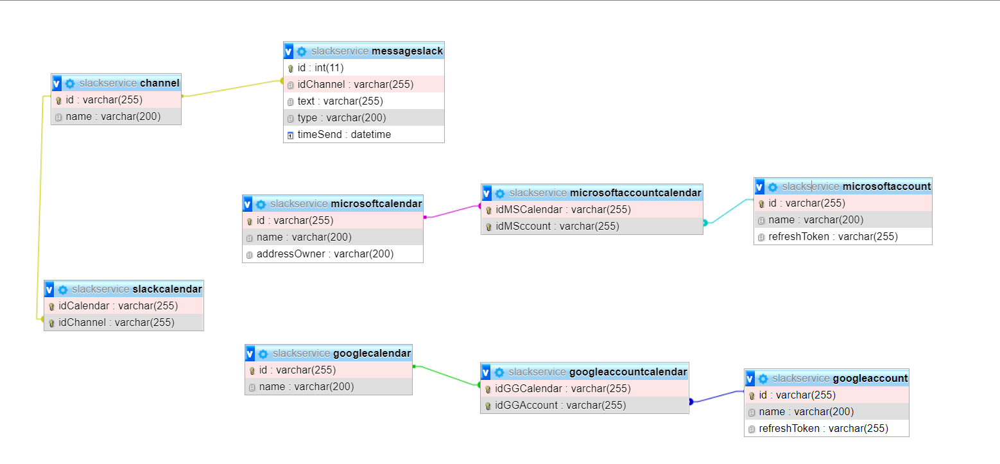

# Design Database
***

## Các thành phần đối tượng của dự án Slack - Calendar

### Channel
- Mục đích tạo đối tượng : Lưu trữ các Channel bên Slack app
### MessageSlack
- Mục đích tạo đối tượng : Lưu trữ các message có gửi thông tin yêu cầu Bot về Calendar.
### MicrosoftCalendar
- Mục đích tạo đối tượng : Lưu trữ thong tin các Outlook Calendar cua microsoft
### GoogleCalendar
- Mục đích tạo đối tượng : Lưu trữ thong tin các Google Calendar
### SlackCalendar
- Mục đích tạo đối tượng : bảng trung gian lưu trữ thông tin về các liên kết id của Channel, GoogleCalendar, MicrosoftCalendar.
### MicrosoftAccount
- Mục đích tạo đối tượng : Luu thong tin ve tai khoan Microsoft.
### GoogleAccount
- Mục đích tạo đối tượng : Luu thong tin ve tai khoan Google.
### MicrosoftAccountCalendar
- Mục đích tạo đối tượng : Bang trung gian giua bang MicrosoftAccount va MicrosoftCalendar.
### GoogleAccountCalendar
- Mục đích tạo đối tượng : Bang trung gian giua bang GoogleAccount va GoogleCalendar.

***
## Mối quan hệ giữa các thành phần của dự án

### Channel
- Channel có quan hệ 1-n với thành phần MesageSlack
- Channel có quan hệ 1-n với thành phần SlackCalendar
### MessageSlack
- Channel có quan hệ 1-n với thành phần MesageSlack
### SlackCalendar
- Channel có quan hệ 1-n với thành phần SlackCalendar
- GoogleCalendar có quan hệ 1-n với thành phần SlackCalendar
- MicrosoftCalendar có quan hệ 1-n với thành phần SlackCalendar.
### GoogleCalendar
- GoogleCalendar có quan hệ 1-n với thành phần SlackCalendar.
- GoogleCalendar có quan hệ 1-n với thành phần GoogleAccountCalendar.
### MicrosoftCalendar
- MicrosoftCalendar có quan hệ 1-n với thành phần SlackCalendar.
- MicrosoftCalendar có quan hệ 1-n với thành phần MicrosoftAccountCalendar.
### GoogleAccountCalendar
- GoogleCalendar có quan hệ 1-n với thành phần GoogleAccountCalendar.
- GoogleAccount có quan hệ 1-n với thành phần GoogleAccountCalendar.
### MicrosoftAccountCalendar
- MicrosoftCalendar có quan hệ 1-n với thành phần MicrosoftAccountCalendar.
- MicrosoftAccount có quan hệ 1-n với thành phần MicrosoftAccountCalendar.
### GoogleAccount
- GoogleAccount có quan hệ 1-n với thành phần GoogleAccountCalendar.
### MicrosoftAccount
- MicrosoftAccount có quan hệ 1-n với thành phần MicrosoftAccountCalendar.
***
## Thiết kế cơ sở dữ liệu lưu trữ dữ liệu người dùng.

1. GoogleCalendar
Thuộc tính : 
- `id` string primary key
- `name` string

2. MicrosoftCalendar
Thuộc tính : 
- `id` string primary key
- `name` string
- `addressOwner` string

3. Channel
Thuộc tính : 
- `id` string primary key
- `name` string

4. MesageSlack
Thuộc tính : 
- `id` string primary key
- `idChannel` string foreign key,
- `text` string
- `type` string
- `timeSend` datetime

5. SlackCalendar
Thuộc tính : 
- `idCalendar` string foreign key,
- `idChannel` string foreign key,
- idCalendar + idChannel (Primary key)

6. MicrosoftAccountCalendar
Thuộc tính : 
- `idMSCalendar` string foreign key,
- `idMSAccount` string foreign key,
- idMSCalendar + idMSAccount (Primary key)

7. GoogleAccountCalendar
Thuộc tính : 
- `idGGCalendar` string foreign key,
- `idGGAccount` string foreign key,
- idGGCalendar + idGGAccount (Primary key)

8. GoogleAccountCalendar
Thuộc tính : 
- `id` string primary key,
- `name` string,
- `refreshToken` string

9. MicrosoftAccountCalendar
Thuộc tính : 
- `id` string primary key,
- `name` string,
- `refreshToken` string

Hình minh họa Diagram :

Code Script mysql
[Link Script](ScriptCreateDB.sql)
